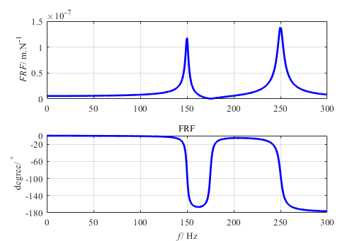
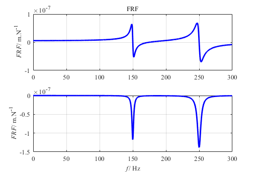

## Question

A shaping process with a two-degree-of-freedom (2-DOF) system is shown in Figure 1. The system flexibilities in directions $x_1$ and $x_2$ are given as:

$$
\begin{array}{c|lcr}
\text{Direction} & \text{ωn} & \text{ζ} & \text{k} \\\\
\hline
x1 & ωn1 = 250Hz & ζ1 = 1.2\  \%  & k1 = 2.26×108 N/m \\\\
x2 & ωn2 = 150Hz & ζ2 = 1.0\  \% & k2 = 2.13×108 N/m
\end{array}
$$

The cutting force is ${F_y} = {K_f}ah\left( t \right)$  ，where the cutting constant $Kf=1000{\rm MPa}$. The flexibilities are oriented with $θ1=30°$ and $θ2=-45°$ from the y axis. Plot the stability lobe of the system.

<b>Figure 1.  2-Dof shaping process</b> 

## Answer

The real part of the oriented transfer function between the displacement in the $ y $ direction and the cutting force $ F_y $ is:

$$
\begin{gathered}
  {\text{R}}\Phi \left( {j\omega } \right) = G\left( {j\omega } \right) = \frac{{y\left( {j\omega } \right)}}{{{F_y}\left( {j\omega } \right)}}  \\
   = {\cos ^2}{\theta _1}\frac{{1 - r_1^2}}{{{k_1}\left[ {{{\left( {1 - r_1^2} \right)}^2} + {{\left( {2{\zeta _1}{r_1}} \right)}^2}} \right]}} + {\cos ^2}{\theta _2}\frac{{1 - r_2^2}}{{{k_2}\left[ {{{\left( {1 - r_2^2} \right)}^2} + {{\left( {2{\zeta _2}{r_2}} \right)}^2}} \right]}}  \\
\end{gathered}
$$

Where $r_{1,2}=ω/ω_{n1,2}$. The orientation function are given in Figure 2. and Figure 3.

<b>Figure 2. Magnitude of two modals</b> 

<b>Figure 3. Real and image part of two modals</b> 

When the real part are negative, the alim should be:
$${a_{\lim }}{\text{ = }}\frac{{ - 1}}{{2{K_f}G\left( {{\omega _c}} \right)}}$$

The phase shift of the structure’s transfer function should be:
$$\tan \psi  = \frac{{H\left( {{\omega _c}} \right)}}{{G\left( {{\omega _c}} \right)}} = \frac{{\sin {\omega _c}T}}{{\cos {\omega _c}T - 1}}$$

The phase difference between the inner and outer modulation should be:
$$\begin{gathered}
  \varepsilon {\text{ = }}2\pi  - 2{\tan ^{{\text{ - }}1}}\left( {\frac{G}{H}} \right)\;\;\;H < 0 \ \\
  \varepsilon {\text{ = }}\pi  - 2{\tan ^{{\text{ - }}1}}\left( {\frac{H}{G}} \right)\;\;\;H > 0  \\ 
\end{gathered} $$

The rotation speed should be:
$$\Omega {\text{ = }}\frac{{2\pi {f_c}}}{{2\pi k + \varepsilon }}\;\;\;\;\;\;k = 0,1,2...$$

The stability lobes are given in Figure 4.

<b>Figure 4. Stability lobes</b> 

