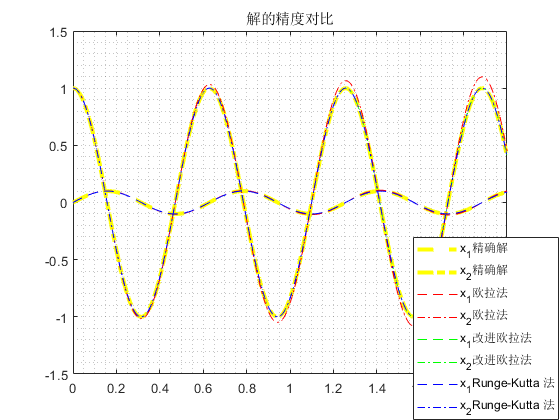

# Numerical methods  comparison

这里对比三种数值积分方法，分别是<b>欧拉法</b>、<b>改进欧拉法</b>和<b> $4$ 阶 Runge-Kutta 法</b>

由二阶微分动力学方程：

$$ m \ddot{x} + kx = u \tag{1} $$

可以化为对应的一次微分方程组:

$$ \left[ {\begin{array}{*{20}{c}}
{{{\dot x}_1}}\\
{{{\dot x}_2}}
\end{array}} \right]{\rm{ = }}\left[ {\begin{array}{*{20}{c}}
0&{\frac{1}{m}}\\
{ - k}&0
\end{array}} \right]\left[ {\begin{array}{*{20}{c}}
{{x_1}}\\
{{x_2}}
\end{array}} \right] + \left[ {\begin{array}{*{20}{c}}
0\\
1
\end{array}} \right]u \tag{2} $$

其中，$\dot{x}_1=\frac{1}{m}x_2$; $\ \ \  \dot{x}_2=-kx_1+u $，即为用于解析法和数值法计算所需的 Cauchy form。

这里给定常量：$m=1$， $k=100$， $u=0$.
给定初始条件：$x_1(0)=0$，$x_2(0)=1$.

## 解析法

```matlab
M=1; K=100; U=0;
[x1,x2] = dsolve('Dx1=1/M*x2,Dx2=-K*x1+U','x1(0)=0,x2(0)=1');
h = 0.001;
time = 0: h: 2;
for i=1:length(time)
    t=time(i);
    val_x1(i)=eval(x1);
    val_x2(i)=eval(x2);
end
figure
plot(time,val_x1 ,'y--',time,val_x2, 'y-.', 'linewidth', 3)
hold on
```

## 数值法

在使用数值法时需要定义函数

```matlab
function F = f(t,x)
    M=1; K=100; U=0;
    F=[1/M*x(2); -K*x(1)+U];
end
```


### 欧拉法

```matlab
h = 0.001;
t = 0: h: 2;
n = length(t);
x(:, 1) = [0; 1];

for k = 1: n-1
    x(:, k + 1) = x(:, k) + h * f(t(k), x(:, k));
end

x1_Euler = x(1, :);
x2_Euler = x(2, :);
plot(t,x1_Euler,'r--',t,x2_Euler,'r-.')
```


### 改进欧拉法

```matlab
h = 0.001;
t = 0: h: 2;
n = length(t);
x(:, 1) = [0; 1];

for k = 1: n-1
    K1 = f(t(k), x(:, k));
    K2 = f(t(k+1), x(:, k) + h * K1);
    x(:, k + 1) = x(:, k) + h * (K1 + K2)/2;
end

x1_Improve_Euler = x(1, :);
x2_Improve_Euler = x(2, :);
plot(t,x1_Improve_Euler ,'g--',t,x2_Improve_Euler,'g-.')
```


### Runge-Kutta 法

```matlab
h = 0.001;
t = 0: h: 2;
n = length(t);
x(:, 1) = [0; 1];

for k = 1: n-1
    K1 = f(t(k), x(:, k));
    K2 = f(t(k) + h/2, x(:, k) + h/2 * K1);
    K3 = f(t(k) + h/2, x(:, k) + h/2 * K2);
    K4 = f(t(k+1) , x(:, k) + h * K3);
    x(:, k + 1) = x(:, k) + h * (K1 + 2*K2 + 2*K3 +K4)/6;
end

x1_RK = x(1, :);
x2_RK = x(2, :);
plot(t, x1_RK, 'b--', t, x2_RK, 'b-.')
```

## 结果

<div align = "center">



</div>

<p align = "center"><b>Figure 1. Result</b> </p>