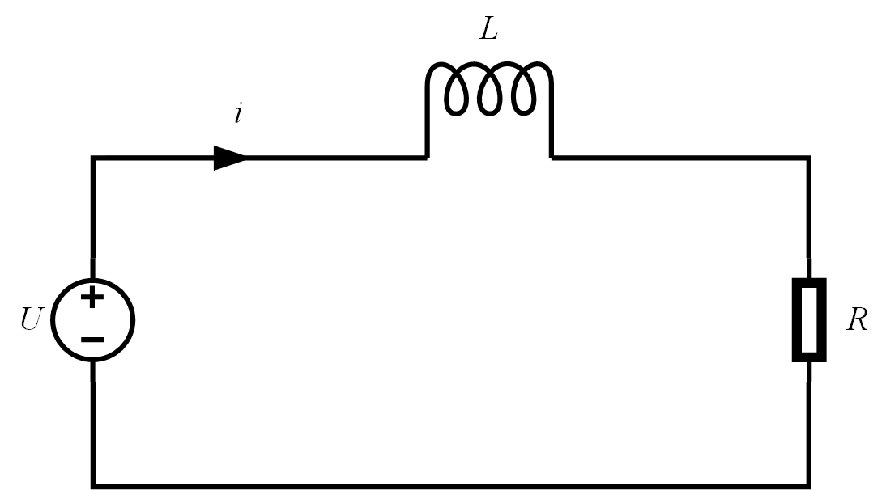
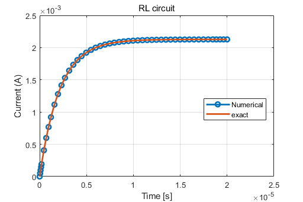

# RL 系统
RL 系统电路简图如下：

<b>Figure 1.  RL System</b> 

## 解析解

根据基尔霍夫电流定律：

$$ L \frac{di}{dt} + Ri = U \tag{1} $$

即：

$$ \frac{di}{dt} = \frac{U-Ri}{L} \tag{2} $$

式 $(2)$ 称为“柯西形”微分方程。
可以通过<b>[一阶微分方程的解法](https://zhuanlan.zhihu.com/p/85229526)</b>求得该方程。
将式 $(2)$ 写为一阶微分方程的标准形式：

$$ \frac{di}{dt} + \frac{R}{L}i = \frac{U}{L} \tag{3} $$

式 $(3)$ 对应的积分因子为：

$$ I(t) = e^{\int{\frac{R}{L}}dt} \sim e^{\frac{R}{L}t} \tag{4} $$

式 $(3)$ 左右两端乘以积分因子：

$$ \frac{di}{dt} e^{\frac{R}{L}t} + \frac{R}{L}i \ e^{\frac{R}{L}t} = \frac{U}{L} e^{\frac{R}{L}t} \tag{5} $$

所以有：

$$ \frac{d{\left(i \ e^{\frac{R}{L}t}\right)}}{dt} = \frac{U}{L} e^{\frac{R}{L}t} \tag{6} $$

两端积分有：

$$ i \ e^{\frac{R}{L}t} = \frac{U}{R} e^{\frac{R}{L}t} + C \tag{7} $$

由初始条件：$i(0) = 0$ 有：$C = -\frac{U}{R}$

因此，得到微分方程的解析解为：

$$ i = \frac{U}{L} \left( 1 - e^{-\frac{R}{L}t}\right) \tag{8} $$

## 数值解

在MATLAB中以 Cauchy Form 的微分方程为基础，利用不同的数值积分函数去求解微分方程。
这里以 `ODE45` 为例。
 `ODE45` 表示采用四阶-五阶 Runge-Kutta 算法，它用 $4$ 阶方法提供候选解，$5$ 阶方法控制误差，是一种自适应步长（变步长）的常微分方程数值解法，其整体截断误差为$(\Delta x)^5$。解决的是 Nonstiff (非刚性)常微分方程。
`ode45` 是解决数值解问题的首选方法，若长时间没结果，应该就是刚性的，可换用 `ode15s` 尝试。

## 结果

<b>Figure 2.  Result</b> 

