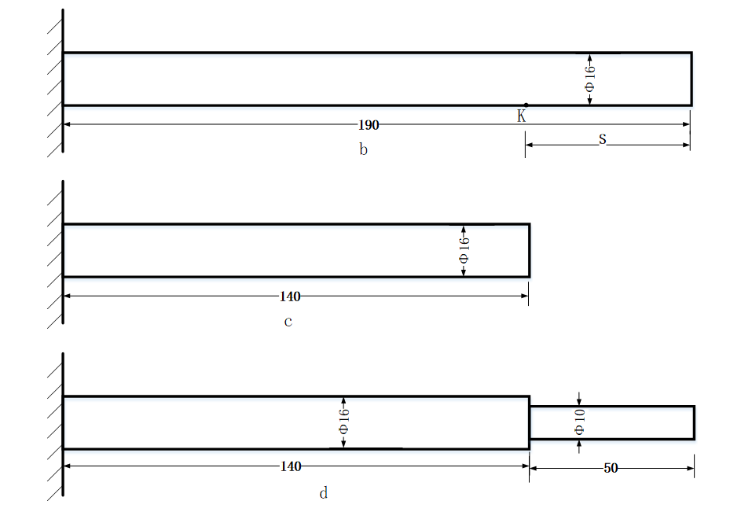

# 关于Beam Experiment Platform的实验及结果分析
这是一个简化的子结构和逆子结构试验，但思想具有普遍性，可以用于刀具刀柄的计算。

## 实验材料及设备
7075铝合金制成的底座、夹持套和三个不同的细长梁

 

  

<b>试验梁尺寸</b>

 

1. 长为190mm，直径为16mm 梁b
2. 长为140mm，直径为16mm 梁c
3. 长为190mm，140mm段长的直径为16mm，50mm段长直径为10mm 梁d

加持长度均为10mm

为了通过子结构耦合法计算耦合不同结构后的组合体自由端的频响G00，先要利用逆子结构法获得剔除一段之后的自由端整体频响G33。但要想得到G33，先要知道运用逆子结构法所需的几个值：未剔除之前的自由端整体频响G11，以及被剔除部分在自由状态下的两端整体原点及跨点频响R11、R22、R12、R21，当剔除部分的形状规则时，R11、R22、R12、R21很容易由理论计算方法得到，但G11还需在用实验方法得到剔除前的端点处原点频响H11和距端点S的K点跨点频响H12之后方能计算得到，这里采用一阶差分法。

## 实验思路：
利用悬臂梁b的自由端处原点位移/力频响b-H11和距自由端50mm（可以是其他值，这里与剔除长度相同是一个巧合）的K点处的跨点位移/力频响b-H12以及自由端到K点的距离S，通过逆子结构法进行计算得到剔除50mm后的端点频响，并与c-H11比较。然后通过子结构法耦合一段50mm，直径是10mm的梁，得到端点频响，并与d-H11比较。

## 程序的解释
1.	ReadData.m
读取BEP0620.xls 文件中的试验频响，注意这里的频响单位，可能不同试验的单位不同。
结果存为BEPData.mat文件，里面包括，梁b的原点、跨点位移/力频响：b_190_h11NEW、b_190_h12NEW；梁c的原点位移/力频响：c_140_h11NEW；梁d的原点、跨点位移/力频响：d_190_h11NEW、d_190_h12NEW。
2.	TheoreticalFRF.m
用Timoshenko梁理论计算梁的频响。结果存为Beam_Theoretical.mat文件，里面包括190mm φ16mm 圆柱悬臂梁的理论端点频响RA；50mm φ16mm 圆柱两端自由梁的理论两端原点跨点频响RB11、RB12、RB21、RB22；140mm φ16mm 圆柱悬臂梁的理论端点频响RC；50mm φ10mm 圆柱两端自由梁的理论两端原点跨点频响RD11、RD12、RD21、RD22。
里面涉及函数Beam_FRF.m 和 函数 timo_free_free.m ，用于Timoshenko梁计算。
3.	CompareRCSA.m 是将140mm φ16mm 圆柱悬臂梁与50mm φ16mm 圆柱两端自由梁耦合得到G11RCSA，并与试验结果b_190_h11NEW比较；
涉及函数RCSA.m ，即子结构耦合计算方法。
4.	CompareIRCSA.m 是通过逆子结构法由190mm φ16mm 圆柱悬臂梁的试验频响剔除50mm，得到140mm φ16mm 圆柱悬臂梁的端点频响G11IRCSA，并与试验结果c_140_h11NEW比较。并将结果存为IRCSA，包含剔除后的端点频响G11IRCSA等。
涉及函数Experimental_IRCSA.m 和 IRCSA.m，即逆子结构耦合计算方法。
5.	CompareFinalResults.m 是将190mm φ16mm 圆柱悬臂梁剔除50mm后再耦合上50mm φ10mm 圆柱梁，用子结构法计算端点频响，并与试验结果d_190_h11NEW比较。验证逆子结构的可靠性。
