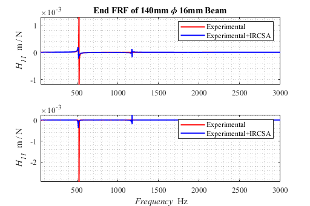

# Experiment verification of Receptance Coupling Substructure Analysis
This a simplified experiment to verify the Receptance Coupling Substructure Analysis ($RCSA$) methods which can be applied to the Frequency Receptance Functions ($FRFs$) measurement of tool holder with different tools.
## Experimental materials
Three different types cylindrical beam made by $7075$ aluminum and clamp equipment.
 

<b>Parameters of Cantilever Beam</b>

 

1. Beam $b$. Length:$190$ mm, Diameter:$16$ mm;
2. Beam $c$. Length:$140$ mm, Diameter:$16$ mm;
3. Beam $d$. Section $I$, Length:$140$mm, Diameter:$16$mm; Section $II$, Length:$50$mm, Diameter:$16$mm.

## Experiment methods：
For simplification of modelling process and comparison between experiment and theoretical results, the cantilever beams was used to conduct experiment.

In order to predict the $FRFs$ at the free end of cantilever beam $d$ from the tap testing data of cantilever beam $b$, $RCSA$ method was applied.

The difference between beam $b$ and beam $d$ is the Section II where the diameter of the cylindrical beam changed. Therefore, if the end $FRFs$ of the same section (i.e. the $FRFs$ at the end of cantilever beam $c$) can be calculated based on the tap testing data get from cantilever beam $b$, then the $FRFs$ at the of cantilever beam $b$ can be obtained by using $RCSA$ method to coupling a beam with length $50$ mm and diameter $10$ mm to the cantilever beam $c$.

In order to get the FRFs at the free end of cantilever beam $c$ (denoted as $G_{00}$) based on the tap testing data at the free end of cantilever beam $b$, inverse $RCSA$ method was used. The different section between cantilever beam $c$ and cantilever beam $b$ is a cylindrical beam with length of $50$ mm and diameter of $16$ mm. The $FRFs$ of this part in free-free condition can be calculated using Timoshenko beam model, including direct $FRFs$ and cross $FRFs$, i.e. $RB_{11}$, $RB_{12}$, $RB_{21}$ and $RB_{22}$.
If the $FRFs$ at the end of cantilever beam $b$ called $G_{11}$, then $G_{00}$ can be obtained by:

$${G_{00}} = R{B_{21}}{\left( R{B_{11}} - {G_{11}} \right)^{ - 1}}R{B_{12}} - R{B_{22}} \tag {1}$$

The $G_{11}$ contains four entries:
$$ G_{11}=\begin{bmatrix}{H_{11}}&{L_{11}}\\\\
{N_{11}}&{P_{11}}\end{bmatrix} = \begin{bmatrix}{\frac{{{X_1}}}{{{F_1}}}}&{\frac{X_1}{M_1}} \\\\
{\frac{\Theta _1}{F_1}} & {\frac{\Theta _1}{M_1}} \end{bmatrix}$$

where $X_1$ and $\Theta_1$ are the displacement and rotational angle at the free end of cantilever beam $b$ respectively, while $F_1$ and $M_1$ are the force and moment applied at the free end of cantilever beam $b$ respectively.

However, only $H_{11}$ can be directly obtained by tap testing, other entries of $G_{11}$ can be evaluated as:

$$ {L_{11}} = {N_{11}} = \frac{\left( {{H_{11}} - {H_{12}}} \right)}{s} \tag {3}$$

where $s$ is the cross distant of cross $FRF$ ---- $H_{12}$ between point $K$ (as shown in the figure above) and the free end of the cantilever beam $b$.

$$ P_{11} = \frac{\Theta_1}{M_1} = {\frac{F_1}{X_1}} {\frac{X_1}{M_1}} {\frac{\Theta_1}{F_1}} = {\frac{1}{H_{11}}}{L_{11}}{N_{11}} = {\frac{{N_{11}^2}}{H_{11}}} \tag {4} $$

After obtaining the $G_{00}$, the $FRFs$ at the free end of cantilever beam $d$ (denoted as $G_{22}$) can be obtained by coupling a cylindrical beam with length of $50$ mm and diameter of $10$ mm using $RCSA$ method. The $FRFs$ of this part in free-free condition can be calculated using Timoshenko beam model, including direct $FRFs$ and cross $FRFs$, i.e. $R{D_{11}}$, $R{D_{12}}$, $R{D_{21}}$ and $R{D_{22}}$.
Then $G_{22}$ can be obtained by:
$${G_{22}} = R{D_{11}} - R{D_{12}}{\left( {{G_{00}} + R{D_{22}}} \right)^{ - 1}}R{D_{21}} \tag{5}$$

## Explanation of the MATLAB Code
1.	BEPData.mat
This file includes the direct and cross Displacement/Force FRFs at the free and of cantilever beam b measured by tap testing: 190_h11NEW、b_190_h12NEW; The direct Displacement/Force FRF at the free and of cantilever beam c measured by tap testing: c_140_h11NEW; The direct Displacement/Force FRF at the free and of cantilever beam c measured by tap testing: d_190_h11NEW.

2.	TheoreticalFRF.m
Theoretical FRFs calculated by Timoshenko beam model. The results was saved as Beam_Theoretical.mat file, which includes FRFs at the free end of a cylindrical cantilever beam with length 190 mm and diameter 16 mm (i.e. RA); Direct and cross FRFs of a cylindrical free-free beam with length 50 mm and diameter 16 mm (i.e. RB11, RB12, RB21 and RB22); FRFs at the free end of a cylindrical cantilever beam with length 140 mm and diameter 16 mm (i.e. RC); Direct and cross FRFs of a cylindrical free-free beam with length 50 mm and diameter 10 mm (i.e. RD11, RD12, RD21 and RD22)。
Involving the function Beam_FRF.m and timo_free_free.m are the algorithms of FRFs’ calculation based on Timoshenko beam theory.

3.	CompareRCSA.m
Coupling a cylindrical cantilever beam (length: 140 mm, diameter: 16 mm) with another cylindrical free-free beam (length: 50 mm, diameter 16 mm) and obtained the FRFs at the free end of the cylindrical cantilever beam b, G11RCSA, then compared with the experimental results b_190_h11NEW.
Involving the function RCSA.m which is the algorithms of RCSA.

<b>Verification of RCSA</b>

 

4.	CompareIRCSA.m
Decoupling a cylindrical free-free beam (length: 50 mm, diameter 16 mm) from a cylindrical cantilever beam (length: 190 mm, diameter: 16 mm) by inverse RCSA method and obtained the FRFs at the free end of the cylindrical cantilever beam c, G11IRCSA, then compared with the experimental results c_140_h11NEW. The results was saved as IRCSA.mat.
Involving the function Experimental_IRCSA.m and IRCSA.m are the algorithms of inverse RCSA method.

<b>Verification of Inverse RCSA</b>

 

5.	CompareFinalResults.m
Based on the G11IRCSA obtained above, the RCSA method was applied to coupling a cylindrical free-free beam (length: 50 mm, diameter 10 mm) to obtain the FRFs at the free end of a cylindrical cantilever stepped beam d, then compared with the experimental results d_190_h11NEW.

<b>Comprehensive Verification</b>

 
